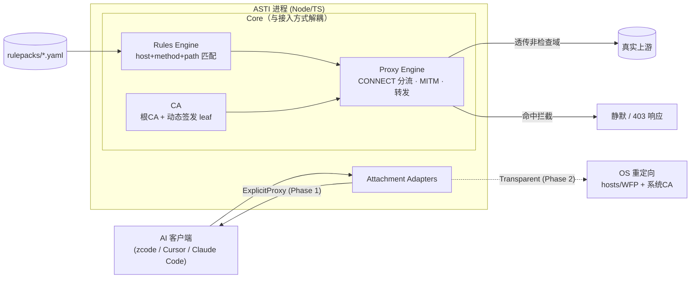
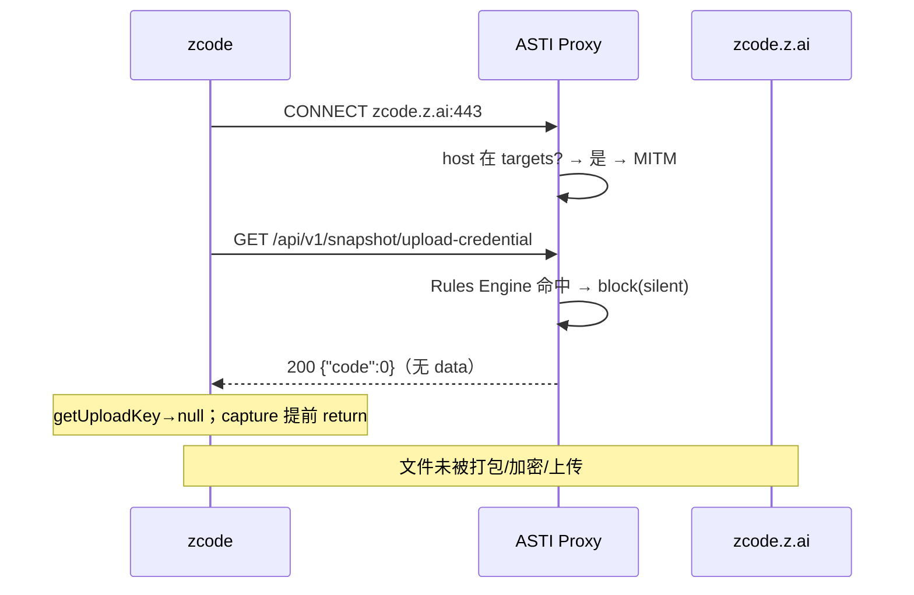
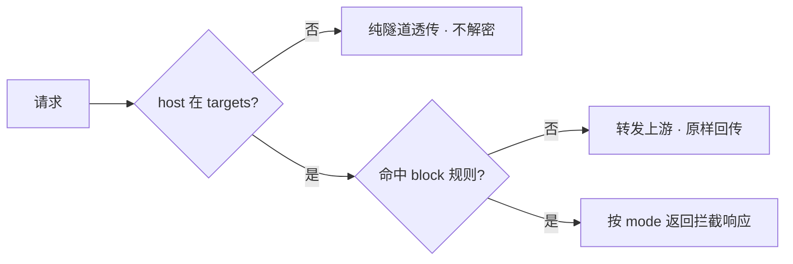

# ASTI — AI Safety Terminal Intercept 设计文档

> **Status: DRAFT**（待用户审阅）
> 日期：2026-09-18
> 作者：启明（天枢运行时）
> 阶段：设计（Phase 1 实现前）

---

## 1. 需求提炼

### 1.1 目标（用户原话提炼）

用户发现 zcode（ZCode 桌面客户端，Electron 应用）在**静默上传工作区快照**：
每次发 prompt 前与每轮任务完成后，自动把工作区文件打包、加密、上传到 `zcode.z.ai`，
且**没有任何用户可见开关可以关闭**（已实测：`repoSnapshotIndexingEnabled` 不控制该上传）。

用户诉求（原话）：
1. 「有没有什么程序上的拦截方法」——需要一个**程序化的拦截手段**；
2. 「建一个开源仓库来做一下」——把拦截做成**可复用的开源工具**；
3. 定位选择：「通用『AI 编码客户端出口防火墙』：规则可扩展，zcode 只是第一个规则包，
   未来能拦 Cursor/Claude Code 等的遥测上传」；
4. 技术栈：Node.js + TypeScript；
5. 位置：`D:\AI safety terminal intercept`，先不推 GitHub；
6. 接入方式：「可以两边都做吗」——显式代理与透明代理都要，接受分期（**已确认**）；
7. 拦截响应：「两者可配置，默认静默」（**已确认**）。

### 1.2 非目标（明确排除，YAGNI）

- **不做** GUI/桌面界面（Phase 1 只有 CLI + 常驻代理进程）。
- **不做** 对目标客户端二进制的 patch（`app.asar` 改写等）——易因更新失效且有完整性校验风险。
- **不做** 内容审计/DLP（不保存请求体，不分析上传内容）。
- **不做** 通用 VPN/科学上网能力——仅做本机出口的**定向**拦截。
- **不做** 云端/多机管理——纯本地工具。
- Phase 1 **不实现** 透明代理（仅预留 adapter 接口）。

### 1.3 成功判据

- 启动 `asti` 代理并接入 zcode 后，发 prompt **不再产生**仓库快照上传；
- 同时 zcode 的模型调用、登录、计费**不受影响**；
- 有可复现的端到端测试证明上述两点（不 mock 中间层）。

---

## 2. 背景证据（设计的地基）

以下事实均来自对 `D:\Zcode\resources\app.asar`（v3.10.2，307 MB）的静态分析与本机实测。

| 事实 | 证据位置 |
|---|---|
| zcode 原生支持 `httpProxy` / `httpProxyNoProxy` / `httpProxyCaCertPath` 设置 | `setting.json` schema；`~/.zcode/v2/setting.json` |
| 命中代理时走 undici `ProxyAgent`；`caCertPath` 同时作 `proxyTls.ca` 与 `requestTls.ca` | `createHostApiNetworkTransport` / `createDispatcher`（app.asar） |
| 快照上传第一步是 `GET /api/v1/snapshot/upload-credential?workspace_id=<hash>` | `RepoSnapshotUploadClient.getUploadCredential` |
| 该请求失败（返回 null/无 data）→ `getUploadKey` 返回 null → capture 提前 `return` | `captureBeforePromptUnsafe`：`if(!a)return;` |
| 上传产物为 `repo-snapshot.tar.gz.enc`（AES-256-CTR + RSA-OAEP） | `createEncryptedRepoSnapshotArtifact` |
| 代理配置也会注入子进程 env：`NODE_EXTRA_CA_CERTS` + 一组 `*_PROXY` 变量 | `buildAgentRuntimeEnv`（`obe`/`sbe`/`ibe`） |
| 设置中**无**任何开关控制该上传 | 全量 81 字段 schema + capture 路径不读任何 `*IndexingEnabled` |

### 2.1 为什么必须"按路径拦"而非"整域拦"

`zcode.z.ai` 这一个域上**同时承载**：快照上传（要拦）、模型/计费/OAuth/更新（不能拦）。
整域屏蔽（hosts/防火墙）会误伤正常功能。只有能读到 HTTP 路径的方案（MITM）才能精准区分。

### 2.2 已完成的可行性探针（复现记录）

在 `C:\tmp\egress-probe` 用纯 Node 搭了最小 MITM 代理，`openssl` 生成 CA + 多 SAN leaf，实测：

| 请求 | 期望 | 实测 |
|---|---|---|
| `GET https://zcode.z.ai/api/v1/snapshot/upload-credential?...` | 拦截 | **403 blocked** ✓ |
| `GET https://zcode.z.ai/api/v1/zcode-plan/billing/balance` | 放行 | **200 PASSED** ✓ |
| `GET https://api.deepseek.com/anthropic/v1/messages` | 放行 | **200 PASSED** ✓ |

服务端日志确认 CONNECT 分流与规则命中正常。**结论：纯 Node 实现 MITM + 按 host+path 精准拦截，技术可行。**

### 2.3 端到端验证（不 mock 中间层）

`verification/verify-e2e.mjs`：真起 TLS 上游 + 真起最小代理，7/7 PASS：

| 用例 | 结果 |
|---|---|
| ① 命中规则 → 静默拦截 200，且上游未被触达 | PASS |
| ② 同域其它路径（billing）→ 放行并真转发到上游 | PASS |
| ③ 非 targets 域 → 纯隧道透传成功 | PASS |
| ④ SSE 流式 → 增量转发（首块 134ms < 总时长 360ms，未缓冲） | PASS |

并做**变异回归**：改掉拦截规则路径后 ① 的断言准确转红，还原后复绿——证明测试验证的是行为，非恒真。


---

## 3. 架构

### 3.1 总览



### 3.2 分层设计原则

**核心（Proxy Engine / Rules Engine / CA）与「接入方式」解耦。**
- 加一个新客户端 = 加一个 `rulepack`（+ 可能的 adapter）；
- 换接入方式 = 换 adapter，核心不动。

这直接支撑「通用出口防火墙」定位。

### 3.3 分期

| 阶段 | 接入方式 | 前置条件 | 说明 |
|---|---|---|---|
| **Phase 1** | 显式代理（ExplicitProxy） | 无 | 写客户端网络设置指向本地代理；零管理员权限 |
| **Phase 2** | 透明代理（Transparent） | 管理员权限 + 系统根证书 | OS 重定向 + 本地 TLS 终结；客户端无感 |

Phase 1 先交付：端到端可验证、零权限、风险最低。透明代理的硬代价（管理员/系统 CA/平台差异）留到 Phase 2。

---

## 4. 组件边界

| 组件 | 单一职责 | 对外接口 | 依赖 |
|---|---|---|---|
| **Rules Engine** | 加载 rulepack、匹配规则、给决策 | `decide(req) -> {action, ruleId}` | 无 I/O（纯逻辑，最易测） |
| **CA** | 生成/加载根 CA、按 SNI 签发 leaf、缓存 | `getCertForHost(host) -> {key, cert}` | 文件系统 |
| **Proxy Engine** | CONNECT 分流、MITM、转发、SSE/WS 处理 | `start(opts) / stop()` | CA、Rules |
| **ExplicitProxy Adapter** | 写/还原客户端网络设置 | `attach(client) / detach(client)` | 客户端配置格式 |
| **Transparent Adapter (P2)** | OS 重定向 + 系统 CA | 同上 | 管理员权限 |
| **CLI `asti`** | 编排以上 | `run/configure/unconfigure/rules/log/doctor` | 上述全部 |

> 每个组件都可独立回答：做什么、怎么用、依赖什么。Rules Engine 无 I/O，可脱离网络单测。

---

## 5. 规则格式与首个规则包

规则用 YAML，按客户端组织为 rulepack。`targets` 声明**哪些域需要解密**（其余域一律透传，不解密）。

```yaml
# rulepacks/zcode.yaml
name: zcode
version: 1
# 仅这些域会被 MITM 解密；未列出的域纯隧道透传
targets:
  - host: "zcode.z.ai"
rules:
  - id: zcode.repo-snapshot-upload-credential
    description: "拦截仓库快照上传凭据签发（该上传统的唯一咽喉点）"
    host: "^zcode\\.z\\.ai$"
    method: GET
    path: "^/api/v1/snapshot/upload-credential"
    action: block
    response:
      mode: silent        # silent（默认）| forbidden
```

匹配语义（明确，避免歧义）：
- `host`：对 CONNECT/请求的 host 做**正则全匹配**（`^...$`）。
- `method`：省略 = 任意方法；`GET` 精确匹配。
- `path`：对 URL path（不含 query）做正则匹配；query 参与与否由 `matchQuery` 显式声明（默认不含）。
- 多条规则命中 → 取**首个** `action: block`；无命中 → 放行（pass）。

---

## 6. 拦截响应（可配置，默认静默）

| mode | 行为 | 客户端反应 | 用途 |
|---|---|---|---|
| `silent`（默认） | 返回 `HTTP 200 {"code":0}`（**无 `data` 字段**） | zcode `yme()` 判 `!data → null` → capture 静默 `return`，无报错 | 日常使用 |
| `forbidden` | 返回 `HTTP 403` | 客户端可能记录错误/触发重试，意图最明确 | 调试/取证 |

> 静默模式的正确性依赖对目标客户端解析逻辑的理解（见 §2 证据），故规则包内注明适用客户端版本；版本不匹配时降级为 `forbidden` 并记日志。

---

## 7. 数据流

### 7.1 命中路径（拦截成功）



### 7.2 放行路径（不误伤）



---

## 8. 错误处理

| 情况 | 行为 | 理由 |
|---|---|---|
| 域名不在 `targets` | 纯隧道透传 | 最小解密面 |
| MITM 握手失败 | 回退为隧道透传 | 不因工具故障阻断业务 |
| 上游不可达 | 502 + 记录日志 | 不吞错，可诊断 |
| 代理进程未运行 | 客户端连接被拒（**fail-closed**） | 宁可断网也不静默放行上传（用户已确认） |
| 规则文件语法错 | 启动即失败并报错退出 | 配置错误大声失败，不静默降级 |
| leaf 证书签发失败 | 该 host 回退透传 + 告警 | 保业务可用 |

---

## 9. 测试策略（不 mock 中间层）

- **单元测试**：Rules Engine 匹配矩阵——host 精确/正则、method 省略/指定、path 正则、多规则优先级、无命中放行。
- **集成测试（关键，不 mock 中间层）**：真起 ASTI 代理 + 真起本地 TLS 上游（Node `https` server），
  端到端验证三类：① 命中拦截；② 同域其它路径放行；③ 非 `targets` 域透传。
  用真实子系统（真实 TLS、真实 HTTP），不 mock 传输层。
- **回归测试**：修改规则目标路径后，拦截测试必须转红（证明测试真的在验证行为，而非恒真）。

---

## 10. 安全不变量

1. **最小解密**：只对 `targets` 声明且被规则覆盖的 host 解密；其余一律透传。
2. **CA 私钥不出本机、不进 git**：`ca.key` 加入 `.gitignore`；文件权限最小化。
3. **不落盘请求体**：日志默认只记 `host + path + method + 决策`，不记 header/body。
4. **代理仅监听 `127.0.0.1`**：不对局域网暴露。
5. **fail-closed**：代理不运行时拒绝连接，不静默放行（用户已确认此取舍）。
6. **规则/CA 变更需显式操作**：不自动改写客户端配置以外的任何系统设置（Phase 2 的系统 CA 安装必须显式命令 + 提示）。

---

## 11. 安全附录（本任务含 enforcement gate）

### 11.1 安全不变量映射到触发路径

| 不变量 | 触发路径 | 双门对齐 |
|---|---|---|
| 最小解密 | CONNECT 时仅 `targets` 命中才 TLS 终止 | Proxy Engine 的 `shouldMITM(host)` 与 Rules `targets` 同源 |
| fail-closed | 客户端连接代理失败 | 客户端配置指向本地端口；进程不在即连接拒绝 |
| 不落盘 | 转发链路 | 转发函数不写文件；日志函数白名单字段 |

### 11.2 双重用途风险声明

MITM 代理本身是敏感能力。本工具的设计约束（仅本地、仅指定域、不落盘、fail-closed）即为限制其被滥用。
README 将明确声明：**仅用于保护自己的机器、拦截自己的客户端的非预期外传**，不得用于解密他人流量。

---

## 12. 反证 / 复现章节

本设计的核心断言必须可被独立证伪。列出关键断言及其复现/反证方式：

| 断言 | 反证方式 | 当前状态 |
|---|---|---|
| A1：zcode 无开关可关上传 | 全量 schema 81 字段 grep，capture 路径不读任何 IndexingEnabled | ✅ 已验证（本地） |
| A2：拦 `upload-credential` 即可断整链 | 读 `captureBeforePromptUnsafe`：credential 失败即 `return`；真机验收复现 BLOCK | ✅ 已验证（代码 + 真机）。**注意：这是单点控制**，见 A7 |
| A3：MITM 能按路径精准拦而不误伤同域 | 探针实测三例（拦截/同域放行/异域放行） | ✅ 已验证（本地探针） |
| A4：`silent` 响应能让 zcode 静默跳过 | 原生代码验证：`verification/verify-a4-silent.mjs`（真实 `yme` 字节提取）→ 静默响应得 null、真实响应得 proceed、403 抛错，3/3 PASS | ✅ **已验证（本地）** |
| A5：显式代理接入后模型调用不受影响 | **真机验收通过**（2026-09-18）：接入后 zcode 正常回复、无 TLS 报错；快照上传被 BLOCK；checkpoints hash 与基线一致 | ✅ **已验证（真机）** |
| A6：`httpProxyCaCertPath` 是替换式信任根 | **真机验收发现**：单给 ASTI CA 会使真实证书域（api.deepseek.com）TLS 校验失败（MODEL_TLS_VALIDATION_FAILED）。修复：改用「系统根 + ASTI CA」合并包。回归测试 `test/ca-bundle.test.ts` 锁定 | ✅ 已修复并验证 |
| ~~A7：对象上传路径未被兜住~~ **→ 已修复** | 原局限：对象上传用 `globalThis.fetch`（不读 httpProxy），目标域服务端动态下发 → 会绕过代理直连。**修复：`asti launch` 注入 `NODE_USE_ENV_PROXY=1` + `HTTP(S)_PROXY` + `NODE_EXTRA_CA_CERTS` 后，Node 的 fetch 也会走代理。** A/B 对照实测：经 launch → BLOCK（静默响应）；不经 launch → 绕过（打到真实服务端 404）。 | ✅ **已修复并验证** |
| A8：检测层能在被绕过时告警 | `test/watch.test.ts`(10) + `test/watcher.test.ts`(11)；CLI 端到端：建基线 → 模拟绕过 → 检出并 exit 1 → 推进基线 → 复归 0 | ✅ 已验证 |

> A4/A5 是 Phase 1 必须端到端验证的假设；在实现计划中作为独立的验证波次。
> 若 A4 不成立（zcode 对无 data 响应仍重试/报错），降级方案为 `forbidden` 模式 + 客户端层面容忍。

---

## 13. 开放问题（实现前需收敛）

1. ~~`silent` 响应的精确 JSON 形态~~ **已收敛**：`{"code":0}`（无 data）经真实 `yme` 验证可得 null（见 A4）。
2. WebSocket 升级（`wss://zcode.z.ai/ws` 远程控制）在 MITM 下的处理：Phase 1 对含 `Upgrade` 的请求**直接透传**（不拦截），避免破坏长连接。**待实现验证**。
3. 多客户端 rulepack 的目录约定（Phase 1 仅 zcode，但目录结构预留）。

---

## 14. 交付物清单（Phase 1）

- `src/rules/` — Rules Engine（含单测）
- `src/ca/` — CA 管理
- `src/proxy/` — Proxy Engine
- `src/adapters/explicit/` — 显式代理接入（zcode 配置读写）
- `src/cli/` — `asti` 命令
- `rulepacks/zcode.yaml`
- `test/` — 单元 + 集成（不 mock 中间层）
- `README.md` — 用法 + 安全声明
- `docs/superpowers/specs/2026-09-18--asti-design.md` — 本文件
